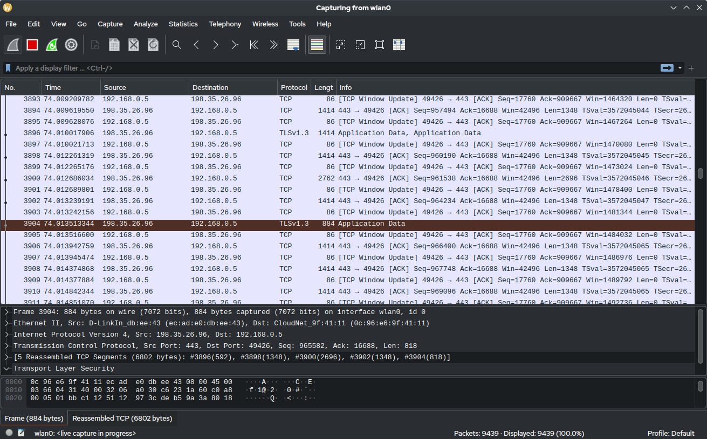

% Technologie Sieciowe
% Piotr Kocia
% March 2023

# Ping
`ping` is a networking utility tool for exploration and diagnosis of IP networks
based on ICMP packets. `ping` uses ICMP `ECHO_REQUEST` to elicit an ICMP
`ECHO_RESPONSE` response from a host. Datagrams sent by `ping` consist of an
ICMP header (8 bytes) and an IP header (20 bytes).

## Traceping and route length
I have written a small bash script, called `traceping`, for checking route
lengths to various hosts. `traceping` exploits TTL by repeatedly pinging a host
increasing TTL each fail until the host is finally reached.
```bash
#!/bin/bash

function help() {
    echo "traceping [options] destination"
    echo ""
    echo "OPTIONS"
    echo "  -h, --help  Display help."
    echo "  -s, --size  Set the size of the packet in bytes. The default is 56"
    echo "              resulting in a total of 84 ICMP bytes when combined"
    echo "              the 8 byte ICMP header."
    exit 1
}

function error() {
    echo "error: $1"
    help
}

# -o is required.
parsed_arguments=$(getopt -n traceping --long help,size: -o h,s: -- "$@")
if [[ "$?" == "1" ]]; then
    help
fi

eval set -- "$parsed_arguments"
size=56
while :
do
    case "$1" in
        --)           shift; break;;
        --size|-s)    size=$2; shift 2;;
        --help|-h)    help;;
        *)            error "invalid option: $1.";;
    esac
done

if [ -z $1 ]; then
    error "missing destination"
fi

for i in {1..255}; do
    result=$(ping -s $size -c 1 -t $i -W 1 $1)
    if [[ "$?" == "0" ]]; then
        ttl=$(echo $result | grep -oP "ttl=\d+" | cut -c 5-)
        echo "route length to $1 is $i (return TTL $ttl)"
        break
    fi
done
```
Example usage
```
> bash ./traceping aut.ac.nz
route length to aut.ac.nz is 33 (return TTL 33)
> bash ./traceping -s 1400 aut.ac.nz
route length to aut.ac.nz is 33 (return TTL 33)
```
We may see that the route length to `aut.ac.nz` is 33 and the return route is
64 - 33 = 31. The size of data within a packet does not affect its routing.

## Packet size and fragmentation
The maximum size of an unfragmented packet (header + data) is 1500 as defined by
the Maximum Transmission Unit (MTU).
```
$ ping -s 1473 -c 1 -M do google.com
PING google.com (216.58.208.206) 1473(1501) bytes of data.
ping: local error: message too long, mtu=1500
```
Most sites do not accept more than 1500 bytes total despite fragmentation being
enabled. The impact of the data size ranges from negligible to small when
compared to the base travel time of a packet with 0 bytes of data.
```
> ping -f -l 0 -n 5 aut.ac.nz

Pinging aut.ac.nz [156.62.238.90] with 0 bytes of data:
Reply from 156.62.238.90: bytes=0 time=315ms TTL=34
Reply from 156.62.238.90: bytes=0 time=315ms TTL=34
Reply from 156.62.238.90: bytes=0 time=315ms TTL=34
Reply from 156.62.238.90: bytes=0 time=315ms TTL=34
Reply from 156.62.238.90: bytes=0 time=315ms TTL=34

Ping statistics for 156.62.238.90:
    Packets: Sent = 5, Received = 5, Lost = 0 (0% loss),
Approximate round trip times in milli-seconds:
    Minimum = 315ms, Maximum = 315ms, Average = 315ms
> ping -l 10000 -n 5 aut.ac.nz

Pinging aut.ac.nz [156.62.238.90] with 10000 bytes of data:
Reply from 156.62.238.90: bytes=10000 time=316ms TTL=34
Reply from 156.62.238.90: bytes=10000 time=316ms TTL=34
Reply from 156.62.238.90: bytes=10000 time=316ms TTL=34
Reply from 156.62.238.90: bytes=10000 time=316ms TTL=34
Reply from 156.62.238.90: bytes=10000 time=316ms TTL=34

Ping statistics for 156.62.238.90:
    Packets: Sent = 5, Received = 5, Lost = 0 (0% loss),
Approximate round trip times in milli-seconds:
    Minimum = 316ms, Maximum = 316ms, Average = 316ms
> ping -l 65500 -n 5 aut.ac.nz

Pinging aut.ac.nz [156.62.238.90] with 65500 bytes of data:
Reply from 156.62.238.90: bytes=65500 time=319ms TTL=34
Reply from 156.62.238.90: bytes=65500 time=318ms TTL=34
Reply from 156.62.238.90: bytes=65500 time=318ms TTL=34
Reply from 156.62.238.90: bytes=65500 time=318ms TTL=34
Reply from 156.62.238.90: bytes=65500 time=318ms TTL=34

Ping statistics for 156.62.238.90:
    Packets: Sent = 5, Received = 5, Lost = 0 (0% loss),
Approximate round trip times in milli-seconds:
    Minimum = 318ms, Maximum = 319ms, Average = 318ms
```

## Diameter of the Internet
It is difficult to determine the diameter of the Internet reliably due to many
variables. Examples of such variables are:

* route taken by a packet of data,
* the route length to the nearest server routing traffic to the outside world.

The longest route I have discovered is 33 to a host in New Zealand.

## Virtual Networks
Virtual networks may reroute packets in peculiar ways resulting in routes much longer than in normal networks despite possibly closer promixity of routers, as well as certain routers might be unreachable from the outside world due to special settings applied. Routing through virtual networks may result in abnormalities in TTL or IP addresses of the responder. A possible example of such a virtual network might be networks located in Mainland China (in this example we are trying to reach a chinese website `taobao.com`)
```
> tracert -h 128 taobao.com

Tracing route to taobao.com [106.11.84.3]
over a maximum of 128 hops:

  1    <1 ms    <1 ms    <1 ms  192.168.0.1
  2     1 ms     2 ms     1 ms  gw1.t4.ds.pwr.wroc.pl [156.17.226.126]
  3     *       14 ms    19 ms  wittiga2-t19.ds.pwr.wroc.pl [156.17.229.236]
  4     1 ms    <1 ms    <1 ms  156.17.229.255
  5     1 ms    <1 ms    <1 ms  156.17.254.50
  6     2 ms     1 ms     1 ms  156.17.254.51
  7     1 ms     1 ms     1 ms  156.17.254.74
  8     1 ms     2 ms     6 ms  156.17.254.64
  9     5 ms     5 ms     5 ms  212.191.224.105
 10     5 ms     5 ms     6 ms  83.97.88.121
 11    21 ms    21 ms    21 ms  62.40.98.130
 12     *        *        *     Request timed out.
 13   261 ms     *        *     202.97.70.141
 14     *        *        *     Request timed out.
 15     *        *        *     Request timed out.
 16     *        *      264 ms  101.95.218.54
 17   279 ms   274 ms   274 ms  101.95.209.62
 18   264 ms   264 ms   268 ms  180.163.38.82
 19   269 ms   268 ms   269 ms  140.205.50.254
 20     *        *        *     Request timed out.
 21   267 ms   267 ms   268 ms  123.56.35.93
 22     *        *        *     Request timed out.
 23     *        *        *     Request timed out.
 24   268 ms   268 ms   268 ms  106.11.84.3
```

# Traceroute
`traceroute` (`tracert` on Windows) is a networking utility tool for exploring
routing paths taken by packets over IP networks. `traceroute` works similarly to
my own utility `traceping` in that it uses TTL to determine the intermediate
routers traversed on the way to destination. An example of a route traced by
`traceroute` from my personal computer to `google.com`
```
$ traceroute google.com
traceroute to google.com (216.58.208.206), 30 hops max, 60 byte packets
 1  DESKTOP-L7LTFEO.mshome.net (172.24.192.1)  0.320 ms  0.210 ms  0.188 ms
 2  192.168.0.1 (192.168.0.1)  0.484 ms  0.382 ms  0.595 ms
 3  gw1.t4.ds.pwr.wroc.pl (156.17.226.126)  1.341 ms  1.661 ms  2.039 ms
 4  wittiga2-t19.ds.pwr.wroc.pl (156.17.229.236)  20.581 ms  20.571 ms  20.564 ms
 5  gw.ha.pwr.wroc.pl (156.17.229.253)  1.475 ms  1.467 ms 156.17.229.255
    (156.17.229.255)  1.458 ms
 6  156.17.254.50 (156.17.254.50)  7.077 ms  1.241 ms  6.171 ms
 7  156.17.254.51 (156.17.254.51)  6.143 ms  1.323 ms  1.306 ms
 8  156.17.254.67 (156.17.254.67)  2.569 ms  1.842 ms  1.828 ms
 9  212.191.237.249 (212.191.237.249)  8.132 ms  8.123 ms  8.115 ms
10  80.249.208.247 (80.249.208.247)  25.744 ms  25.736 ms  26.009 ms
11  108.170.241.204 (108.170.241.204)  26.072 ms 108.170.241.205 (108.170.241.205)
    26.962 ms 108.170.241.236 (108.170.241.236)  26.146 ms
12  108.170.238.129 (108.170.238.129)  27.250 ms 216.239.42.211 (216.239.42.211)
    27.203 ms 209.85.254.157 (209.85.254.157)  25.987 ms
13  142.250.62.139 (142.250.62.139)  30.692 ms 108.170.234.11 (108.170.234.11)
    27.991 ms *
14  142.251.245.208 (142.251.245.208)  28.458 ms 142.251.245.206 (142.251.245.206)
    28.233 ms 142.251.245.164 (142.251.245.164)  29.155 ms
15  142.250.37.193 (142.250.37.193)  28.200 ms  28.308 ms  28.692 ms
16  142.250.224.89 (142.250.224.89)  29.459 ms  29.448 ms 142.250.224.91
    (142.250.224.91)  29.563 ms
17  216.58.208.206 (216.58.208.206)  29.027 ms  28.321 ms  29.009 ms
```
We may see the ping times of each trial and the individual IP addresses of the routers. In this run of `traceroute` appeared an asterisk which indicates that `traceroute` did not receive a response to this ping (timed out).

# Wireshark
Wireshark is a tool for analysis of network traffic (similarly to `tcpdump`). Wireshark is capable of displaying detailed information about every incoming and outgoing packet, including source, destination, protocol, length, header information.



# Conclusions
Presented networking utilities are a set of handy tools for analysis and monitoring of networks, routes, traffic and might be used to draw conclusions about the structure of certain networks. However, due to the complexity and indeterministic nature of the Internet, the results might vary greatly from one individual to another and should be used within the framework of statistical analysis to obtain convincing results.
